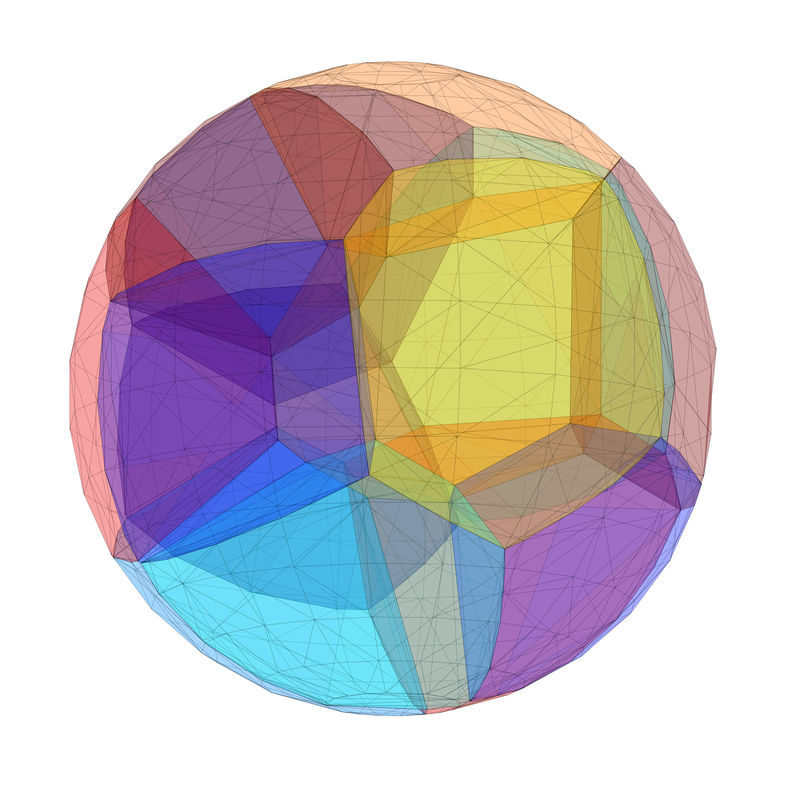

# Voronoi 3D
This code allows the construction of bounded 3D Voronoi diagrams inside an arbitrary polytope. 

Given a set of seeds, the code first constructs the corresponding Delaunay triangulation using an iterative insertion flipping algorithm. Next, the dual Voronoi diagram is extracted. It is implemented in such a way that the Voronoi diagram is automatically bounded inside a specified polytope.

## Complex example
In the following example, we see how the code has been used to generate secondary pulmonary lobules inside a lung geometry.

## Usage
An example of how to use this is found in *./example/.

The most high-level interface is in *voronoi.h*. One can pass either an array of seeds or generate them inside of the Bounding Polyhedron using the method of *Poisson disc sampling* with a user specified sizing function (local minimum distance between points). The output is the corresponding Voronoi diagram structure (*vd_3d.h*). 

### References
Source for the Delaunay algorithm: *Computing the 3D Voronoi Diagram Robustly: An Easy Explanation. Hugo Ledoux.*

Geometric predicates: [danshapero/predicates](https://github.com/danshapero/predicates).

Convhull_3d: [leomccormack/convhull_3d](https://github.com/leomccormack/convhull_3d).
